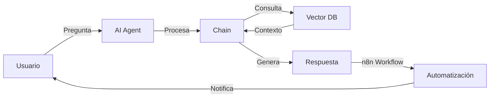

<div align="center">
  
</div>

<div align="center">
  
### 💻 Software Developer | 🤖 AI Agent Creator | ⚡ n8n Automation Specialist
  
[](https://www.linkedin.com/in/greiberthperezz/)
[](https://github.com/gperezz11/)

</div>

---

## 👨‍💻 Sobre Mí

```python
class GreiberthPerez:
    def __init__(self):
        self.name = "Greiberth Pérez"
        self.role = "Software Developer & AI Automation Specialist"
        self.languages = ["Python", "JavaScript"]
        self.specialties = {
            "backend": ["Django"],
            "automation": ["n8n", "Workflow Automation"],
            "ai": ["AI Agents", "OpenAI API"],
            "analytics": ["Power BI", "Data Visualization"]
        }
        self.mindset = "Building intelligent solutions that work autonomously"
    
    def say_hi(self):
        print("🤖 Transformando ideas")

me = GreiberthPerez()
me.say_hi()
```

Soy un desarrollador apasionado por crear soluciones tecnológicas robustas y escalables. Especializado en desarrollo backend con Python, automatización de procesos con n8n, y creación de agentes inteligentes con IA. Mi enfoque combina análisis de datos avanzados en Power BI con la potencia de la inteligencia artificial para construir sistemas que trabajan de forma autónoma. Siempre en busca de nuevos desafíos que impulsen mi crecimiento profesional.

---

## 🛠️ Stack Tecnológico

<table>
<tr>
<td valign="top" width="25%">

### Backend Development
<div align="center">
  


</div>
</td>

<td valign="top" width="25%">

### AI & Automation
<div align="center">
  


</div>
</td>

<td valign="top" width="25%">

### Frontend Development
<div align="center">
  


</div>
</td>

<td valign="top" width="25%">

### DevOps & Tools
<div align="center">
  


</div>
</td>
</tr>
</table>

---

## 🤖 Especialización en IA y Automatización

<div align="center">

### 🎯 Lo que puedo construir

</div>

<table>
<tr>
<td width="50%">

#### 🔮 Agentes de IA
- ✨ Agentes conversacionales inteligentes
- 🧠 Sistemas RAG para búsqueda semántica
- 🔗 Multi-agent workflows
- 💬 Chatbots con memoria contextual
- 📚 Procesamiento de documentos con IA

</td>
<td width="50%">

#### ⚡ Automatización con n8n
- 🔄 Workflows complejos sin código
- 🌐 Integración de +350 servicios
- 📧 Automatización de emails y notificaciones
- 🔔 Triggers inteligentes y webhooks

</td>
</tr>
</table>

<div align="center">



</div>

---

## 📊 Estadísticas de GitHub

<div align="center">
  
  
</div>

<div align="center">
  
</div>

---

## 🎯 Enfoque Actual

```yaml
learning:
  - "Creación de agentes autónomos con n8n y OpenAI"
  - "Automatización avanzada de workflows con n8n"
  - "Arquitecturas de microservicios Django"
  - "Integración de AI en aplicaciones Django"
  - "Dashboards interactivos con Power BI"

building:
  - "🤖 Agentes de IA conversacionales"
  - "⚡ Automatizaciones inteligentes con n8n"
  - "📊 Pipelines de análisis de datos"
  - "🔗 APIs RESTful escalables"

exploring:
  - "RAG (Retrieval-Augmented Generation)"
  - "Multi-agent systems"
  - "Cloud AI Services (Azure OpenAI, AWS Bedrock)"
  - "Vector databases (Pinecone, Weaviate)"
```

---

## 🏆 Áreas de Especialización

<div align="center">

| 💼 Backend Development | 🤖 AI & Automation | 📊 Data Analytics | 🚀 DevOps |
|:---:|:---:|:---:|:---:|
| Django | AI Agents Development | Power BI Dashboards | Docker & Kubernetes |
| RESTful APIs | n8n Workflow Automation | Data Visualization | CI/CD Pipelines |
| Microservices | OpenAI API Integration | Business Intelligence | Cloud Deployment |

</div>

---

## 💡 Filosofía de Trabajo

> "El único límite está en tu mente. La IA no reemplaza humanos, potencia su creatividad."

🔹 **Automatización Inteligente** - Si una máquina puede hacerlo, debe hacerlo  
🔹 **Código limpio y mantenible** - Escribo para humanos, ejecuto para máquinas  
🔹 **Aprendizaje continuo** - La IA evoluciona, yo también  
🔹 **Soluciones escalables** - Pensando en el futuro desde el día uno  
🔹 **Innovation-driven** - Convirtiendo ideas complejas en sistemas autónomos  

---

## 📫 Conectemos

<div align="center">

[](https://www.linkedin.com/in/greiberthperezz/)
[](mailto:tu-email@ejemplo.com)

**¿Tienes un proyecto interesante? ¡Hablemos!** 🚀

</div>

---

<div align="center">
  
### 💬 "Code is like humor. When you have to explain it, it's bad." - Cory House


**Made with 💙 by [Greiberth Pérez](https://github.com/gperezz11)**

</div>
